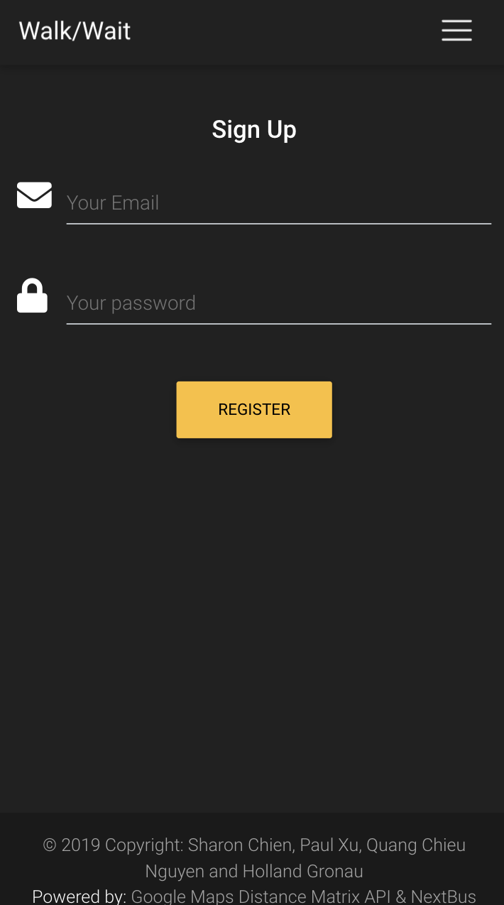
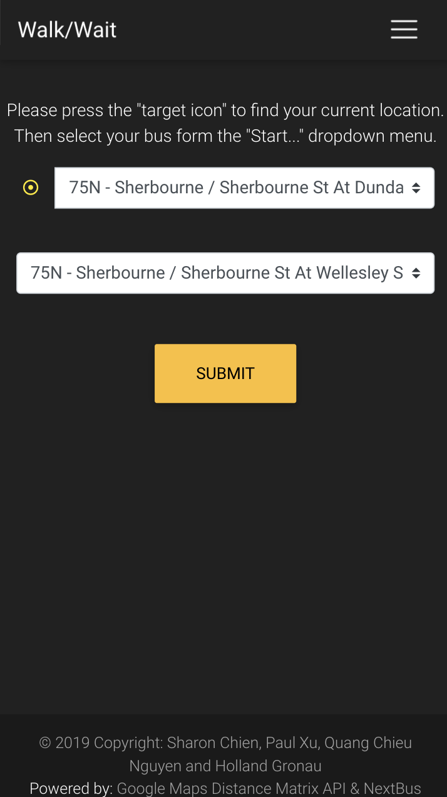
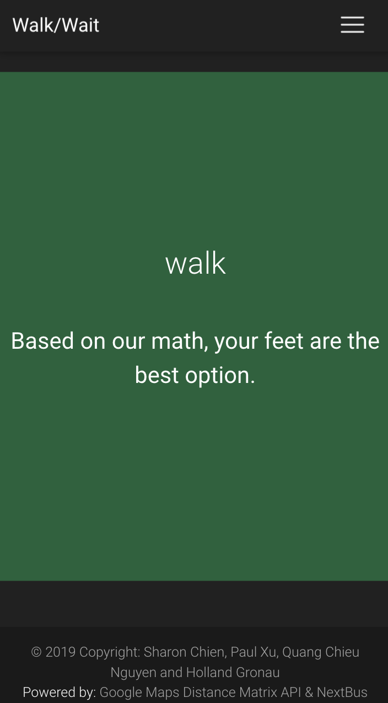
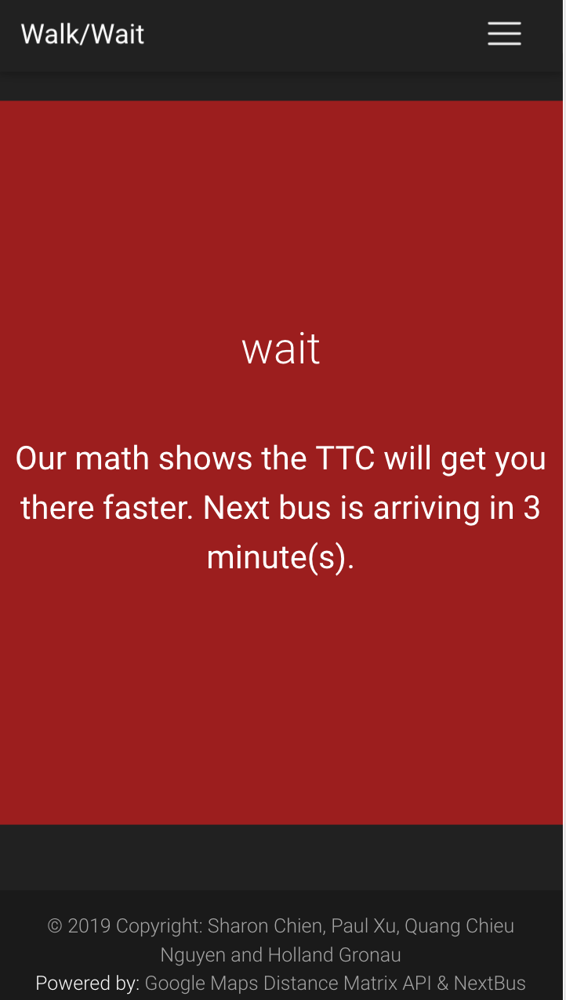
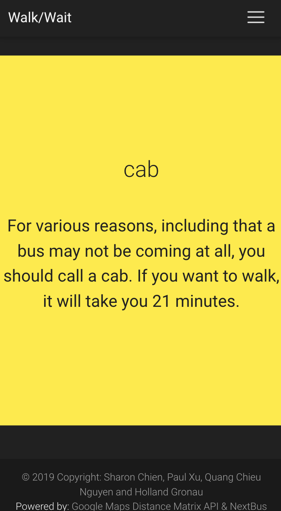

# WalkOrWait

### What is Walk/Wait?
The walk/wait dilemma occurs when waiting for public transit you start to ponder if the wait will exceed the time for you to walk to your location. 

Everyone who has used public transit in a large city had that moment where they considered this dilemma. It’s a universal experience we don’t often talk about and I am sure you yourself reading this is remembering a time you have considered this yourself. What if math could decide this for you using an app? That is what we are setting out to do.

To make a simple app where all of the transit information you need to make this decision is compiled and using our proprietary algorithm make this decision for you in seconds. We think this app will improve the transit experience for many. 

### Project Requirements
Our App will be launched on React using a Node Express Server.

We will use two API’s not talked about in class. To meet this we have selected the GoogleMaps API and the TTC Dev API. 
MySQL/MongoDB will be utilized to compile real time route data for each route when requested live by a user.
Authentication will allow us to enhance the user experience by saving common routes data upon login. We will use Passport.js for this component.
For design we plan to use Material Design which allows us to use Bootstrap with added features specifically for react. This will allow us to use jQuery like components for the design of our app.

**Links and Sources**

    - TTC NVAS
    - Google Maps API
    - Our Repo
    - MySQL
    - Passport.js
    - Binomial.js
    - Bcrypts.js
    - MaterialDesign

**Why you need this app in your life?**
In closing the reason this app is needed is Google Maps does not use the real time TTC data but instead goes off of the schedule arrival times. Daily with the TTC buses and streetcars bunch making this information useless. Our app will utilize the real time data which is updated on the TTC Dev API every 15 minutes.  Take a look!

**How this app works?**
In this example if you want to commute from A to B. Tying your depart station/stop + destination stop in the search bar (on the left up corner). After confirming, the user will see two dropped pin --one is the starting position whereas the other is the final destination. In the backend, we will estimate the real/most updated waiting time for taking the next bus and display the time of taking the next bus (including waiting time) and the estimated walking time. Users can contrast the two options and choose the one that costs the least amount of time.

| sign up | sign in | search route |
| :----: | :----: | :----: |
|  |  | 

Assuming that you want to commute from A to B, and you wonder if you should take a bus or walk directly to the destination instead, just tying your departure and destination station/stop in the search bar (on the left up corner). After confirming, you will see two dropped pin --one is the starting position whereas the other is the final destination. In the backend, we will estimate the real/most updated waiting time for taking the next bus and display it (including waiting time) and the estimated walking time. You can contrast the two options and choose the one that costs the least amount of time.

|   walk  |   wait  |   cab  |
| :-----: | :-----: | :-----: |
|  |  |  |

## Algorithms Concerns
Because we are setting out with a limited scope to only server some users of the TTC on limited routes downtown to start we want to make sure we are accounting for discrepancies correctly when building our Algorithm. There are special circumstances such as bush bunching that occurs as well as short turns. Hours of operations of routes and route changes and volume of service (in the instance the bus arriving is already full). Probability should be able to account for most of these but we all want a week to test to ensure we are as close as possible. We also recognize it will never reach perfection. 

Our base algorithm looks like this we take our distance between two points starting and destination. A bus will always travel greater distances than someone who is walking if we start at the same point at the same time (tb). It’s a good starting point that many other factors will need to be worked into but it should be both fun and interesting to add to our project.

Here is the algorithm we are applying for the choice decision by evaluating the time duration of walking and taking public transit (including wait times):

where

**Note:**
1. Please confirm to [install](https://chrome.google.com/webstore/detail/mathjax-plugin-for-github/ioemnmodlmafdkllaclgeombjnmnbima) MathJax Plugin
2. Click [here](https://docs.google.com/document/d1gWVTaPVW_ggl1b3lu_OjKwBCLR22cW8ErXPf4KoLf9k/edit) for viewing presentation

 
    <small> Copyright &copy; 2019 | WalkorWait | Sharon Chien, Paul Xu, Quang Chieu Nguyen and Holland Gronau | All Rights Reserved </small>

